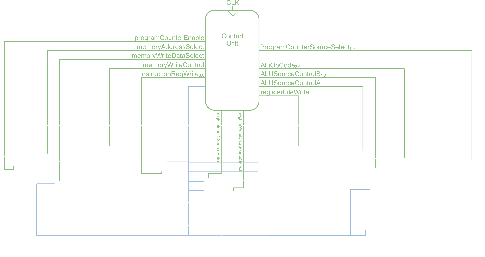

# BP1 Processor
The BP1 is an 8 bit MIPS-based processor implemented in System Verilog. The processor has 256 bits of writable memory and 4 scratch registers, along with several I/O registers. The processor is capable of performing several numerical operations, immediate and memory based data operations, and program control flow. Plans to expand both the instruction set as well as word size to 16 bits are under way.

# Architecture
The BP1 architecture is based on the MIPS processor outlined in Neil H. E. Weste and David Money Harris's "CMOS VLSI Design A Circuits and Systems Perspective, 4th Edition", however, all code is original to the project unless otherwise stated in the source file. Some minor modifications have been added in order to accomodate additional instructions originally not present in the textbook.

A block diagram of the archtecture can be found below. A light-mode diagram can be found in `Figures/`.

# Vivado Project
The BP1 was originally a Vivado project, however, the project has since been reorganized to a more conventional project. The `ecen2350Filan.xpr` xml file can still be openened using Vivado, and should also compile. Vivado will complain about the irregular file structure, but will build the project.

# Control Unit FSM

# Instructions
The BP1 has many instructions, which are detailed in `instructions.md`. Each instruction is 32 bits long and little endian. Instructions are grouped roughly based on the number of arguments they take and which group of data they operate on. Those are 1, 2, and 3 argument instructions, and arithmetic, memory, and instruction data. 

# Next Steps
- Increase word size to 16 bits.
- Optimize fsm
- Implement stack
- Add instructions
  - bneq
  - bc
  - call
  - mult
  - div
- Add FPU
- Add Display Unit

# Bibliography
In the interest of transparency all source files that have code in them based on code that is not original will be listed below, as well as the link to the original source.

| File | Source(s) |
| ---- | --------- |
| genericDeMux.sv | [Stack Exchange](https://electronics.stackexchange.com/questions/552516/how-to-build-large-multiplexers-using-systemverilog)  [EDA Board](https://www.edaboard.com/threads/parameterized-demultiplexer-in-verilog.244364/)|
| genericMux.sv | [Stack Exchange](https://electronics.stackexchange.com/questions/552516/how-to-build-large-multiplexers-using-systemverilog) |
